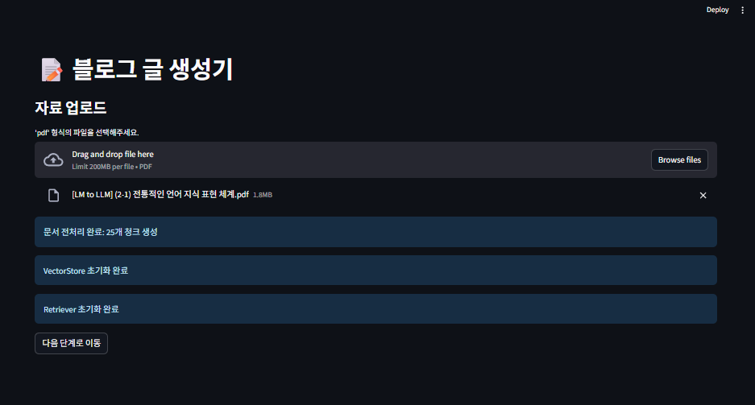
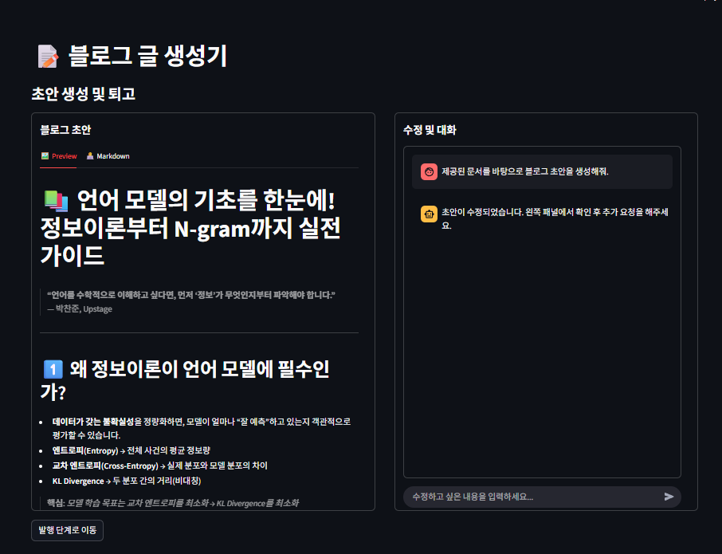
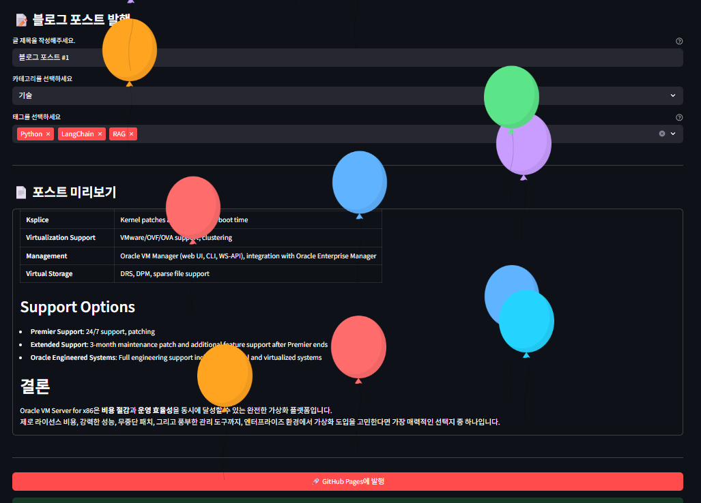
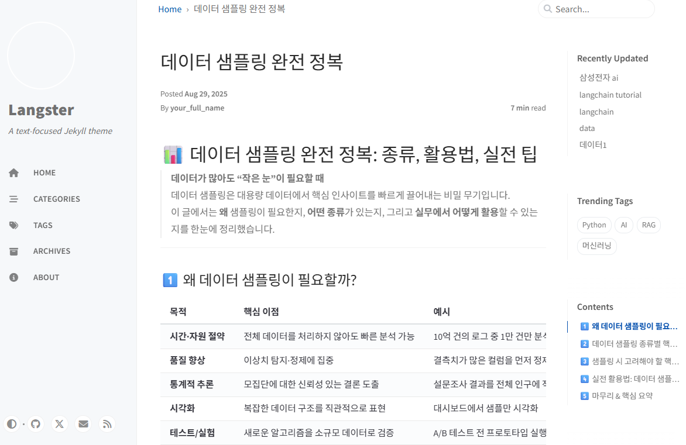
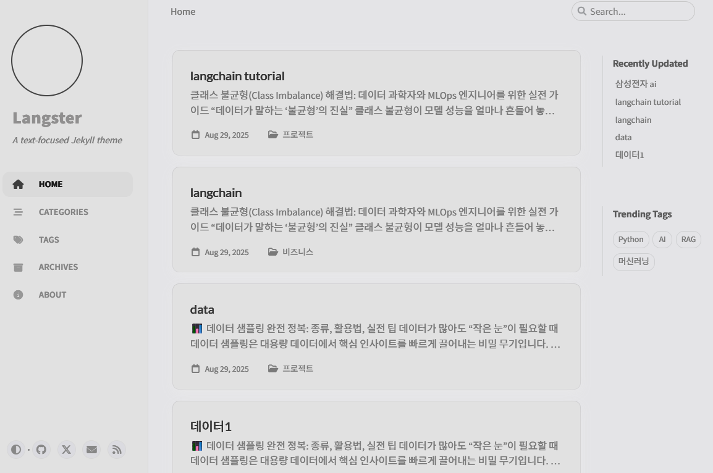
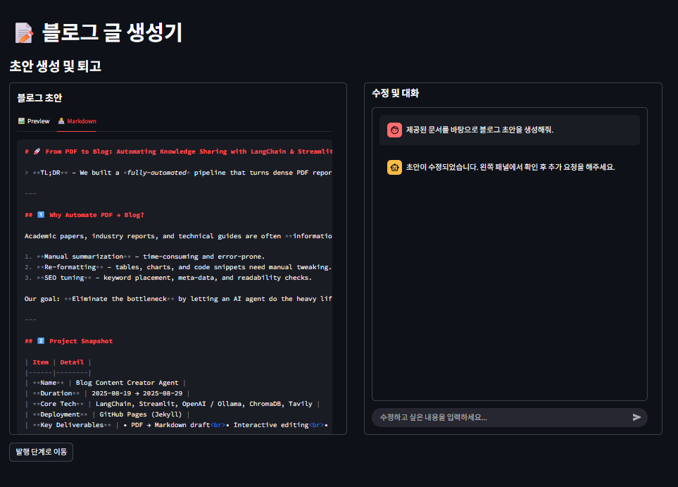
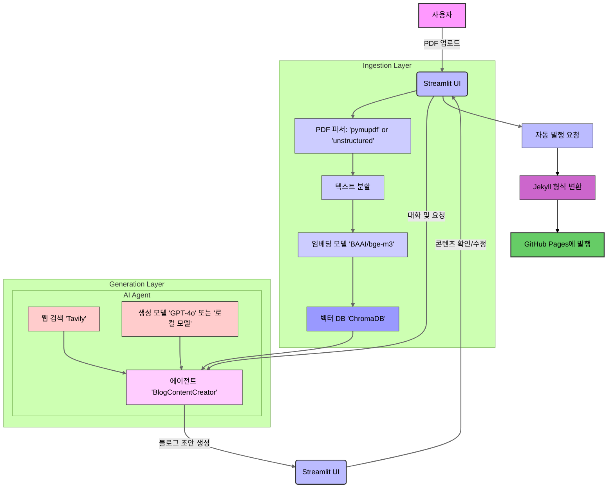

# 📝 Blog Content Creator Agent 
# (Refactor: feat. Chainlit UI)

**PDF 문서를 고품질 블로그 포스트로 자동 변환하고 GitHub Pages에 게시하는 LangChain 기반 자동화 시스템입니다.**

이 프로젝트는 `RAG`(Retrieval-Augmented Generation) 파이프라인을 기반으로, 사용자가 제공한 `PDF` 문서의 내용을 이해하고 요약하여 블로그 초안을 생성합니다. 또한, 웹 검색 도구를 활용하여 최신 정보를 보강하고, 대화형 인터페이스를 통해 사용자의 수정 요청을 실시간으로 반영할 수 있습니다.

## ✨ 주요 특징 (Key Features)

* **RAG 기반 콘텐츠 생성**: `PDF` 문서 내용을 기반으로 정확하고 일관성 있는 블로그 초안을 생성합니다.
* **동적 도구 사용**: `document_search`와 `tavily_search` 도구를 활용하여 문서 및 웹의 정보를 동적으로 결합합니다.
* **설정 가능한 아키텍처**: `config.yaml`을 통해 LLM, 임베딩 모델, 데이터 처리 방식을 유연하게 변경할 수 있습니다.
* **대화형 수정**: Streamlit 기반 UI에서 AI 에이전트와 대화하며 실시간으로 콘텐츠를 수정하고 개선할 수 있습니다.
* **자동 발행**: 완성된 콘텐츠를 Jekyll 형식에 맞게 변환하여 GitHub Pages에 자동으로 게시합니다.


## 🎨 주요 기능 데모 (Key Features Demo)
<!-- 
| 파일 업로드 | 실시간 콘텐츠 편집 |
| :---: | :---: |
| <a href="docs/assets/images/demo/streamlit-ui-fileupload-screen.png"></a> | <a href="docs/assets/images/demo/streamlit-ui-live-editor.png"></a> |
| **1. PDF 문서 업로드** | **2. AI와 대화하며 초안 수정** |
| 발행 성공 | 생성된 블로그 포스트 |
| <a href="docs/assets/images/demo/blog-post-publish-success-screen.png"></a> | <a href="docs/assets/images/demo/ai-generated-blog-post.png"></a> |
| **3. GitHub Pages에 자동 발행** | **4. 고품질 블로그 초안 생성** |
| 블로그 홈페이지 | 생성된 표 예시 |
| <a href="docs/assets/images/demo/ai-generated-blogs-home.png"></a> | <a href="docs/assets/images/demo/ai-generated-blog-post-tables.png"></a> |
| **5. 발행된 블로그 확인** | **6. Markdown 미리보기** |

   -->

## 🚀 빠른 시작 (Quick Start)

### **사전 요구사항**

* Python 3.11+
* Poetry
* **GitHub Pages 설정 완료**: 블로그 발행을 위해 GitHub Pages 리포지토리가 미리 설정되어 있어야 합니다.
### 프로젝트 흐름 다이어그램



**다이어그램 설명:**

  * **Ingestion Layer (수집 계층)**: 사용자가 업로드한 PDF 문서가 텍스트로 변환되고, 임베딩 모델을 통해 벡터로 만들어져 벡터 데이터베이스에 저장되는 과정을 보여줍니다.
  * **Generation Layer (생성 계층)**: AI 에이전트가 벡터 데이터베이스와 웹 검색 도구를 활용하여 블로그 초안을 생성하는 과정을 보여줍니다. 사용자와의 대화를 통해 수정 및 개선이 이루어집니다.
  * **전체 흐름**: 사용자 입력부터 시작하여 콘텐츠 생성, 수정, 그리고 최종적으로 `GitHub Pages`에 발행되는 전체 프로세스를 한눈에 파악할 수 있도록 구성되었습니다.

### **설치 및 실행**

1.  **Repository 클론**
    ```bash
    git clone [https://github.com/AIBootcamp13/upstageailab-langchain-pjt-langchain_8.git](https://github.com/AIBootcamp13/upstageailab-langchain-pjt-langchain_8.git)
    cd upstageailab-langchain-pjt-langchain_8
    ```
2.  **의존성 설치**
    ```bash
    poetry install
    ```
3.  **환경변수 설정**
    ```bash
    cp .env.template .env
    # .env 파일에 OpenAI, Tavily API 키 입력
    ```
4.  **애플리케이션 실행**
    ```bash
    poetry run streamlit run src/main.py
    ```
더 자세한 내용은 [설치 가이드](docs/1_INSTALLATION.md)를 참고하세요.

## 🔨 기술 스택 (Tech Stack)

* **Language**: Python 3.11
* **Frontend**: Streamlit
* **AI/ML**: LangChain, OpenAI, Ollama
* **Vector DB**: ChromaDB
* **Search**: Tavily API
* **Dev Tools**: Poetry, Ruff, pre-commit, Git/GitHub

## 📚 상세 문서 (Table of Contents)

* [테마 블로그 설정 가이드](docs/0_BLOG_SETUP_CHIRPY.md)
* [설치 가이드](docs/1_INSTALLATION.md)
* [사용 방법](docs/2_USAGE_GUIDE.md)
* [시스템 아키텍처](docs/3_ARCHITECTURE.md)
* [설정 및 커스터마이징](docs/4_CUSTOMIZATION.md)
* [기여하기](docs/5_CONTRIBUTING.md)
* [문제 해결 가이드](docs/6_TROUBLESHOOTING.md)

## 📁 프로젝트 구조 (Project Structure)

```
.
├── configs/                  # 설정 파일
├── data/                     # 데이터 디렉토리
├── docs/                     # 문서/가이드
├── logs/                     # 로그 저장소
├── notebooks/                # Jupyter 노트북
├── prompts/                  # 프롬프트 관리
├── scripts/                  # 유틸리티 스크립트
├── src/                      # 소스 코드
│   ├── agent.py              # BlogContentAgent
│   ├── agent_tool.py         # Tavily 웹 검색 도구
│   ├── app.py                # Streamlit 앱 UI
│   ├── config.py             # 중앙 설정 로직
│   ├── document_preprocessor.py # PDF 전처리
│   ├── logger.py             # 로깅 유틸리티
│   ├── main.py               # Streamlit 진입점
│   ├── retriever.py          # RetrieverFactory
│   ├── vector_store.py       # Vector DB
│   └── ui/                   # UI 컴포넌트
└── 
...
```

## 🤝 기여하기 (Contributing)

이 프로젝트에 기여하고 싶으신가요? [기여 가이드](docs/5_CONTRIBUTING.md)를 참고하여 함께 프로젝트를 발전시켜주세요. 모든 기여를 환영합니다!

## **👥 팀 구성원**

## 📄 라이선스 (License)

이 프로젝트는 MIT 라이선스 하에 배포됩니다.
