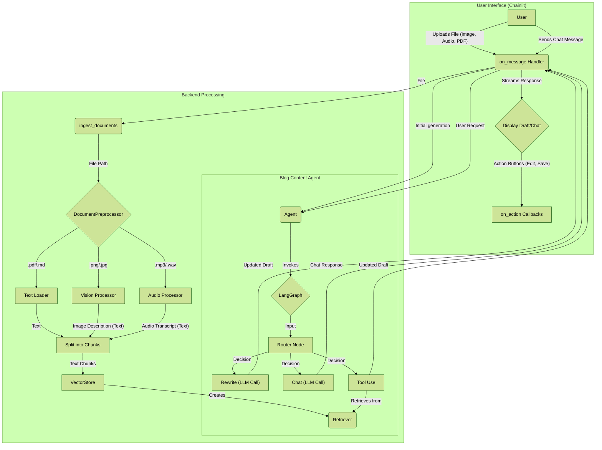

# 📝 블로그 콘텐츠 생성 에이전트 (리팩터링: Chainlit UI 적용)

**다양한 소스 문서(PDF, 오디오, 이미지)를 고품질 블로그 포스트로 자동 변환하고 GitHub Pages에 게시하는 LangChain 기반 자동화 시스템입니다.**

이 프로젝트는 `RAG`(Retrieval-Augmented Generation) 파이프라인을 기반으로, 사용자가 제공한 문서의 내용을 이해하고 요약하여 블로그 초안을 생성합니다. 또한, 웹 검색 도구를 활용하여 콘텐츠를 최신 정보로 보강하고, 완전한 대화형 인터페이스를 통해 실시간으로 수정 요청을 반영할 수 있습니다.

## ✨ 주요 특징 (Key Features)

  * **RAG 기반 콘텐츠 생성**: `PDF, 오디오, 이미지` 문서 내용을 기반으로 정확하고 일관성 있는 블로그 초안을 생성합니다.
  * **동적 도구 사용**: `document_search`와 `tavily_search` 도구를 활용하여 로컬 문서 및 웹의 정보를 동적으로 결합합니다.
  * **설정 가능한 아키텍처**: `config.yaml`을 통해 LLM, 임베딩 모델, 데이터 처리 방식을 유연하게 변경할 수 있습니다.
  * **대화형 수정**: Chainlit 기반 UI를 통해 AI 에이전트와 대화하며 실시간으로 콘텐츠를 수정하고 개선할 수 있습니다.
  * **자동 발행**: 완성된 콘텐츠를 Jekyll 형식에 맞게 변환하여 GitHub Pages 리포지토리에 자동으로 게시합니다.

## 🎨 주요 기능 데모 (Key Features Demo)


**🎞 Chainlit 데모 스크린샷**


_아래는 Chainlit UI와 주요 기능을 보여주는 화면 예시입니다._


<p align="center"><a href="docs/assets/chainlit demo/chainlit_home.png"></a></p>


<p align="center"><em>모델과 프로바이더를 선택할 수 있는 Chainlit 홈 화면입니다.</em></p>


<p align="center"><a href="docs/assets/chainlit demo/chainlit-demo-select-model-modal.png"></a></p>


<p align="center"><em>모델을 선택하는 모달(팝업) 화면 예시입니다.</em></p>


<p align="center"><a href="docs/assets/chainlit demo/chainlit-home-select-provider.png"></a></p>


<p align="center"><em>모델 공급자(provider)를 선택하는 Chainlit UI 화면입니다.</em></p>


<p align="center"><a href="docs/assets/chainlit demo/chainlit-blog-generation-demo.png"></a></p>


<p align="center"><em>블로그 생성 데모의 출력 및 옵션을 보여주는 화면입니다.</em></p>


<p align="center"><a href="docs/assets/chainlit demo/test_audio_terminal_output1.png"></a></p>


<p align="center"><em>오디오 파일을 내용을 출력한 예시 입니다.</em></p>


<p align="center"><a href="docs/assets/chainlit demo/test_audio_terminal_output2.png"></a></p>


<p align="center"><a href="docs/assets/chainlit demo/test_vision_terminal_output.png"></a></p>


<p align="center"><em>PDF 이미지 한장에서 의미를 추출하여 출력한 예시 입니다.</em></p>

## 🚀 빠른 시작 (Quick Start)

### **사전 요구사항**

  * Python 3.11+
  * Poetry
  * Docker
  * **GitHub Pages 설정 완료**: 블로그 발행을 위해 GitHub Pages 리포지토리가 미리 설정되어 있어야 합니다.

### 프로젝트 흐름 다이어그램



**다이어그램 설명:**

  * **Ingestion Layer (수집 계층)**: 사용자의 업로드된 문서가 텍스트로 변환되고, 임베딩 모델을 통해 벡터화되어 벡터 데이터베이스에 저장되는 과정을 보여줍니다.
  * **Generation Layer (생성 계층)**: AI 에이전트가 벡터 데이터베이스와 웹 검색 도구를 활용하여 블로그 초안을 생성하는 과정을 보여줍니다. 사용자와의 대화를 통해 수정 및 개선이 이루어집니다.
  * **전체 흐름**: 사용자 입력부터 콘텐츠 생성, 수정, 그리고 최종적으로 `GitHub Pages`에 발행되는 전체 프로세스를 한눈에 파악할 수 있도록 구성되었습니다.

### **설치 및 실행**

1.  **Repository 클론**
    ```bash
    git clone https://github.com/AIBootcamp13/upstageailab-langchain-pjt-langchain_8.git
    cd upstageailab-langchain-pjt-langchain_8
    ```
2.  **의존성 설치**
    ```bash
    poetry install
    ```
3.  **환경변수 설정**
    ```bash
    cp .env.template .env
    # .env 파일에 OpenAI, Tavily API 키를 입력합니다
    ```
4.  **백엔드 서비스 실행 (Redis)**
    ```bash
    # Docker를 사용하여 캐싱을 위한 Redis 실행
    docker run -d --name redis-stack -p 6379:6379 -p 8001:8001 redis/redis-stack:latest
    ```
5.  **애플리케이션 실행**
    ```bash
    poetry run chainlit run src/chainlit_app.py -w
    ```

더 자세한 내용은 [설치 가이드](https://www.google.com/search?q=docs/1_INSTALLATION.md)를 참고하세요.

## 🔨 기술 스택 (Tech Stack)

  * **Language**: Python 3.11
  * **Frontend**: Chainlit
  * **AI/ML**: LangChain, LangGraph, OpenAI, Ollama
  * **Vector DB**: ChromaDB
  * **Caching DB**: Redis
  * **Search**: Tavily API
  * **Dev Tools**: Poetry, Ruff, pre-commit, Git/GitHub

## 📚 상세 문서 (Table of Contents)

  * [테마 블로그 설정 가이드](https://www.google.com/search?q=docs/0_BLOG_SETUP_CHIRPY.md)
  * [설치 가이드](https://www.google.com/search?q=docs/1_INSTALLATION.md)
  * [사용 방법](https://www.google.com/search?q=docs/2_USAGE_GUIDE.md)
  * [시스템 아키텍처](https://www.google.com/search?q=docs/3_ARCHITECTURE.md)
  * [설정 및 커스터마이징](https://www.google.com/search?q=docs/4_CUSTOMIZATION.md)
  * [기여하기](https://www.google.com/search?q=docs/5_CONTRIBUTING.md)
  * [문제 해결 가이드](https://www.google.com/search?q=docs/6_TROUBLESHOOTING.md)

## 📁 프로젝트 구조 (Project Structure)

```
.
├── configs/                # 설정 파일 (config.yaml)
├── data/                   # 데이터 디렉토리 (ChromaDB 영구 저장)
├── docs/                   # 문서 및 가이드
├── logs/                   # 로그 저장소
├── notebooks/              # 실험용 Jupyter 노트북
├── prompts/                # 프롬프트 관리 (prompts.yaml)
├── public/                 # Chainlit UI 커스텀 자산 (CSS, JS)
├── src/                    # 소스 코드
│   ├── agent.py            # BlogContentAgent 클래스
│   ├── caching.py          # Redis 캐싱 설정
│   ├── chainlit_app.py     # Chainlit UI 진입점
│   ├── config.py           # 중앙 설정 로직
│   ├── document_preprocessor.py # PDF, 이미지, 오디오 처리
│   ├── graph.py            # LangGraph 상태 머신 정의
│   ├── retriever.py        # RetrieverFactory
│   ├── vector_store.py     # Vector DB (ChromaDB) 래퍼
│   ├── audio_processor.py  # 오디오-텍스트 변환 로직
│   ├── vision_processor.py # 이미지-텍스트 변환 로직
│   └── ui/                 # Chainlit UI 모듈
│       └── chainlit/       # 콜백, 핸들러, 설정
└── ...
```

## 🤝 기여하기 (Contributing)

이 프로젝트에 기여하고 싶으신가요? [기여 가이드](https://www.google.com/search?q=docs/5_CONTRIBUTING.md)를 참고하여 함께 프로젝트를 발전시켜주세요. 모든 기여를 환영합니다\!

## **👥 팀 구성원**

## 📄 라이선스 (License)

이 프로젝트는 MIT 라이선스 하에 배포됩니다.