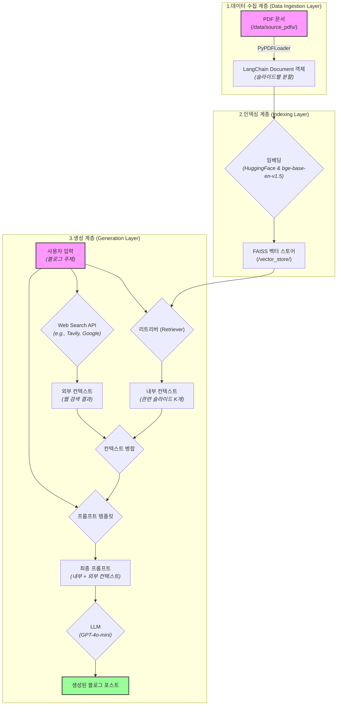

# 프로젝트 이름

## 💻 프로젝트 소개

### <프로젝트 소개>

**목표:**
RAG Langchain 프로젝트 구현 하기

### <작품 소개>

**목표:** 사용자가 정의한 주제에 따라, 제공된 PDF 프레젠테이션 콘텐츠를 활용하여 일관성 있고 잘 구조화된 블로그 포스트를 자동으로 생성하는 시스템을 개발합니다.

## 👨‍👩‍👦‍👦 팀 구성원

|  |  |  |  |  |  |
|:-----------------------------------------------------------:|:------------------------------------------------------------:|:-------------------------------------------------------------:|:-------------------------------------------------------------:|:-------------------------------------------------------------:|:-------------------------------------------------------------:|
|             [조의영](https://github.com/yuiyeong)              |              [최웅비](https://github.com/Wchoi189)              |             [고민주](https://github.com/PaperToCode)             |              [박성진](https://github.com/psj2024p)               |              [조은별](https://github.com/eunbyul2)               |            [김효석](https://github.com/david1005910)             |
|                         팀장, W.I.P.                          |                            W.I.P.                            |                            W.I.P.                             |                            W.I.P.                             |                            W.I.P.                             |                            W.I.P.                             |

## 🔨 개발 환경 및 기술 스택

**언어 및 프레임워크**

- 주 언어: Python 3.11.11
- Frontend: Streamlit (메인 UI)
- AI/ML: LangChain, LangGraph, LangSmith

**벡터 저장소**

- Vector DB: ChromaDB

**LLM APIs**

- OpenAI GPT Models
- Upstage API

**개발 도구**

- 패키지 관리: Poetry
- 버전 관리: Git, GitHub
- 코드 품질: Ruff, Pre-commit
- 개발 환경: JupyterLab, IPython

**협업 도구**

- GitHub (코드 관리, 이슈 트래킹)
- Notion (프로젝트 문서화)
- Slack, KakaoTalk (실시간 소통)

## 📁 프로젝트 구조

### **프로젝트 구조 (Project Structure)**

**목표:** 코드, 데이터, 모델을 체계적으로 관리하여 프로젝트의 유지보수성과 확장성을 높입니다.

다음은 이 프로젝트를 위한 권장 폴더 및 파일 구조입니다.
```text
rag_blog_generator/
│
├── src/                      # 모든 소스 코드를 담는 폴더
│   ├── __init__.py
│   ├── ingestion.py          # 1단계: PDF 로딩 및 데이터 정제 로직
│   ├── indexing.py           # 2단계: 벡터 인덱스 생성 및 저장 로직
│   ├── generation.py         # 3단계: RAG 체인 및 블로그 생성 로직
│   ├── main.py               # 전체 파이프라인을 실행하는 메인 스크립트
│   └── config.py             # 모델 이름, 경로 등 설정 값 관리
│
├── data/                     # 원본 데이터 폴더
│   └── source_pdfs/          # 입력으로 사용할 PDF 프레젠테이션 저장
│
├── vector_store/             # 생성된 벡터 인덱스를 저장하는 폴더
│   └── faiss_index_course_slides/
│
├── notebooks/                # 실험 및 빠른 프로토타이핑을 위한 Jupyter 노트북
│   └── 01_data_ingestion_test.ipynb
│
├── tests/                    # 코드 테스트를 위한 폴더
│   ├── test_ingestion.py
│   └── test_generation.py
│
├── .env                      # API 키 등 민감한 환경 변수 저장
├── requirements.txt          # 프로젝트에 필요한 Python 라이브러리 목록
└── README.md                 # 프로젝트 설명 및 실행 방법 안내
```

## 💻 구현 기능

* **PDF 콘텐츠 기반 생성:** 지정된 PDF 프레젠테이션 파일의 텍스트 콘텐츠를 자동으로 추출하고 처리합니다.
* **RAG 기반 컨텍스트 생성:** 사용자가 입력한 주제와 가장 관련성 높은 슬라이드 내용을 벡터 검색을 통해 찾아내어 LLM에 컨텍스트로 제공합니다.
* **의미 기반 검색:** Sentence Transformer 모델을 활용하여 단순 키워드 매칭이 아닌, 의미적으로 가장 유사한 콘텐츠를 정확하게 검색합니다.
* **자동 블로그 포스트 작성:** 잘 설계된 프롬프트와 강력한 LLM(GPT-4o-mini)을 활용하여, 검색된 컨텍스트를 바탕으로 자연스럽고 논리적인 구조의 블로그 포스트를 자동으로 생성합니다.

## 🛠️ 작품 아키텍처
이 프로젝트는 모듈화된 파이프라인 아키텍처를 따르며, 각 단계는 명확한 역할을 수행합니다.

1. **데이터 수집 계층 (Data Ingestion Layer):**
   * PyPDFLoader를 사용하여 data/source_pdfs/ 폴더에 있는 PDF 문서를 로드하고, 슬라이드(페이지) 단위로 분할하여 LangChain Document 객체로 변환합니다.
2. **인덱싱 계층 (Indexing Layer):**
   * **임베딩:** HuggingFaceEmbeddings와 bge-base-en-v1.5 모델을 사용하여 수집된 Document들을 고차원 벡터로 변환합니다.
   * **벡터 스토어:** FAISS를 사용하여 생성된 벡터를 저장하고, 빠른 유사도 검색이 가능한 인덱스를 구축합니다. 이 인덱스는 vector_store/ 디렉토리에 저장됩니다.
3. **생성 계층 (Generation Layer):**
   * **오케스트레이션:** LangChain Expression Language (LCEL)를 사용하여 전체 생성 과정을 체인으로 구성합니다.
   * **리트리버 (Retriever):** 사용자의 '주제'가 입력되면 FAISS 인덱스에서 가장 관련성 높은 상위 K개의 문서를 검색합니다.
   * **프롬프트 (Prompt):** 검색된 문서(컨텍스트)와 원본 주제를 ChatPromptTemplate에 결합하여 LLM에 전달할 최종 프롬프트를 동적으로 생성합니다.
   * **LLM:** OpenAI GPT-4o-mini/OLLAMA/SOLARPRO 모델이 최종 프롬프트를 입력받아 지시에 따라 블로그 포스트를 생성합니다.



## Getting Started

### Cloud Instance 환경 설정 with Shell Script

**Python 버전과 의존성 관리자(Poetry) 및 Python 관련 설치 및 설정**

1. GPU 서버에 SSH 로 로그인한 다음, 아래 명령어를 입력하여 환경 설정 스크립트 다운로드합니다.
    ```bash
    wget https://gist.githubusercontent.com/yuiyeong/8ae3f167e97aeff90785a4ccda41e5fe/raw/bcf100f01b69df0534841f7cb126f96d307fc460/setup_env.sh
    ```

2. 다운로드 받은 스크립트를 실행 파일로 변경합니다.
    ```bash
    chmod +x setup_env.sh
    ```

3. 실행 파일을 실행합니다.
    ```bash
    ./setup_env.sh
    ```

**이 스크립트는 다음 내용을 설정합니다.**

- 시스템 업데이트 및 Python 빌드 의존성 설치
- /workspace 작업 디렉토리 생성
- Python 3.11 conda 환경 구성
- Poetry 설치 및 경로 설정
- 환경 변수 설정 (HOME, PATH, PYTHONPATH)
- SSH 로그인 시 자동 설정들

### 프로젝트 클론 및 의존성 설치

1. GPU 서버에 SSH 로 로그인한 다음, 아래 명령어로 이 Repository 를 Clone 합니다.
    ```bash
    git clone https://github.com/AIBootcamp13/upstageailab-langchain-pjt-langchain_8.git
    ```

2. 다음 명령어를 실행해서 프로젝트의 환경 설정을 마칩니다.
    ```bash
    cd upstageailab-langchain-pjt-langchain_8

    poetry install --extras dev
    poetry run pre-commit install
    ```

## 🚨 트러블 슈팅

- W.I.P.

## 📌 프로젝트 회고

- W.I.P.

## 📰 참고자료

- [Poetry](https://python-poetry.org/docs/)
- [Ruff](https://docs.astral.sh/ruff/)
- [Pre-commit](https://pre-commit.com/)
- [LangChain Documentation](https://python.langchain.com/docs/introduction/)
- [FastAPI Documentation](https://fastapi.tiangolo.com/)
- [Streamlit Documentation](https://docs.streamlit.io/get-started)
- [OpenAI API Documentation](https://platform.openai.com/docs/overview)
- [Upstage Solar API](https://console.upstage.ai/docs/getting-started)
