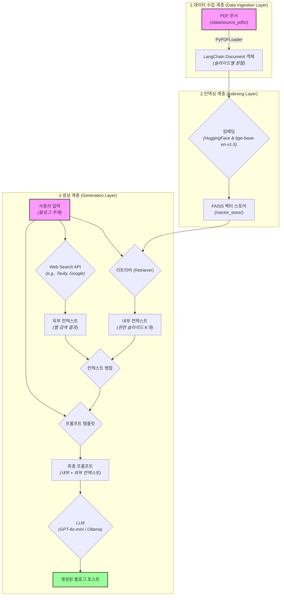

# **RAG 기반 블로그 포스트 생성기**

## **💻 프로젝트 소개**

**목표:**
사용자가 정의한 주제에 따라, 제공된 PDF 프레젠테이션 콘텐츠를 활용하여 일관성 있고 잘 구조화된 블로그 포스트를 자동으로 생성하는 시스템을 개발합니다. 하이브리드 `RAG`(Retrieval-Augmented Generation) 아키텍처를 사용하여 내부 문서 컨텍스트와 외부 웹 검색 결과를 모두 활용해 풍부하고 유익한 콘텐츠를 만듭니다.

## **🔨 개발 환경 및 기술 스택**

### **소프트웨어**

* **주 언어:**
Python 3.11.11

* **Frontend:**
Streamlit (메인 UI)

* **AI/ML:**
LangChain, LangGraph, LangSmith

* **벡터 저장소:**
ChromaDB

* **LLM APIs:**
OpenAI GPT Models, Upstage API, Ollama (gpt-oss-20b)

* **개발 도구:**
Poetry, Git/GitHub, Ruff, Pre-commit, JupyterLab

### **하드웨어 (테스트 환경)**

* **운영 체제:** Ubuntu 20.04.6 LTS
* **CPU:** 32-Core AMD Ryzen Threadripper 3970X
* **메모리 (RAM):** 251.62 GiB
* **GPU:** 4x NVIDIA GeForce RTX 3090 (24GB)
  * **NVIDIA 드라이버 버전:** 535.86.10
  * *(참고: gpt-oss-20b 모델을 실행하려면 최소 16GB의 VRAM을 가진 GPU를 권장합니다.)*

## **📁 프로젝트 구조**

```text
rag_blog_generator/
│
├── src/                      # 모든 소스 코드를 담는 폴더
│   ├── __init__.py
│   ├── ingestion.py          # 1단계: PDF 로딩 및 데이터 정제 로직
│   ├── indexing.py           # 2단계: 벡터 인덱스 생성 및 저장 로직
│   ├── generation.py         # 3단계: RAG 체인 및 블로그 생성 로직
│   ├── main.py               # 전체 파이프라인을 실행하는 메인 스크립트
│   └── config.py             # 모델 이름, 경로 등 설정 값 관리
│
├── data/                     # 원본 데이터 폴더
│   └── source_pdfs/          # 입력으로 사용할 PDF 프레젠테이션 저장
│
├── vector_store/             # 생성된 벡터 인덱스를 저장하는 폴더
│   └── faiss_index_course_slides/
│
├── notebooks/                # 실험 및 빠른 프로토타이핑을 위한 Jupyter 노트북
│   └── 01_data_ingestion_test.ipynb
│
├── tests/                    # 코드 테스트를 위한 폴더
│   ├── test_ingestion.py
│   └── test_generation.py
│
├── .env                      # API 키 등 민감한 환경 변수 저장
├── requirements.txt          # 프로젝트에 필요한 Python 라이브러리 목록
└── README.md                 # 프로젝트 설명 및 실행 방법 안내
```

## **💻 구현 기능**

* **PDF 콘텐츠 기반 생성:**
지정된 `PDF` 프레젠테이션 파일의 텍스트 콘텐츠를 자동으로 추출하고 처리합니다.
* **하이브리드 RAG 파이프라인:**
소스 `PDF`에서 검색된 컨텍스트(`FAISS` 벡터 검색)와 웹 검색 API의 실시간 정보를 결합합니다.
* **로컬 LLM 연동:**
`Ollama`를 사용하여 `gpt-oss-20b`와 같은 강력한 오픈소스 모델을 로컬에서 실행하여 데이터 프라이버시를 보장하고 비용 없이 콘텐츠를 생성합니다.
* **모듈식 아키텍처:**
`LangChain`을 사용하여 리트리버, 프롬프트, `LLM`과 같은 구성 요소를 쉽게 실험하고 수정할 수 있습니다.

## **🛠️ 작품 아키텍처**
이 프로젝트는 모듈화된 파이프라인 아키텍처를 따르며, 각 단계는 명확한 역할을 수행합니다.

1. **데이터 수집 계층 (Data Ingestion Layer):**
`PyPDFLoader를` 사용하여 `PDF` 문서를 로드하고, 슬라이드(페이지) 단위로 분할하여 `LangChain Document` 객체로 변환합니다.
2. **인덱싱 계층 (Indexing Layer):**
`HuggingFaceEmbeddings와` `bge-base-en-v1.5` 모델을 사용하여 수집된 `Document`들을 고차원 벡터로 변환하고, `FAISS` 벡터 스토어에 인덱싱하여 저장합니다.
3. **생성 계층 (Generation Layer):**
사용자의 '주제'가 입력되면 `FAISS` 인덱스와 웹 검색 API에서 관련 컨텍스트를 병렬로 검색합니다. 검색된 컨텍스트들을 병합하여 `ChatPromptTemplate에` 결합한 후, 최종 프롬프트를 LLM(GPT-4o-mini, Ollama 등)에 전달하여 블로그 포스트를 생성합니다.



## **⚙️ 사용법**

1. **소스 PDF 추가:**
   * `data/source_pdfs/` 디렉토리 안에 분석할 PDF 프레젠테이션 파일을 넣습니다.
2. **데이터 수집 및 인덱싱 파이프라인 실행:**
   * 이 작업은 `PDF` 파일당 한 번만 실행하면 됩니다.
```python
    python src/indexing.py
```
3. **블로그 포스트 생성:**
   * 원하는 주제와 함께 메인 생성 스크립트를 실행합니다.
```python
   python src/main.py --topic "최신 AI 아키텍처에 대한 심층 분석"
```
   * 생성된 블로그 포스트는 `output/` 디렉토리에 저장됩니다.
