# Blog Content Creator Agent

## 💻 프로젝트 소개

### 프로젝트 개요

PPT나 문서 자료를 입력받아 고품질 블로그 포스트를 자동 생성하고, 다양한 블로그 플랫폼에 자동으로 게시하는 LangChain 기반 자동화 시스템입니다.

### 주요 특징

- **Advanced RAG**: 다양한 chunking 전략으로 정확한 콘텐츠 생성
- **Hallucination 방지**: LangSmith 활용한 프롬프트 최적화
- **완전 자동화**: 자료 입력부터 블로그 발행까지 원클릭 처리
- **멀티 플랫폼**: 네이버 블로그, 티스토리 등 주요 플랫폼 지원

#### 핵심 기능

**Phase 1: 콘텐츠 생성**

- PPT/PDF 등 자료 입력 → Markdown 형식 블로그 초안 생성
- RAG 기술을 활용한 정확한 정보 추출 및 구조화

**Phase 2: 자동 게시**

- 생성된 콘텐츠를 블로그 플랫폼에 자동 게시
- 로그인 → 글 작성 → 저장/발행까지 완전 자동화

#### 활용 사례

- 회사 발표 자료 → 기술 블로그 포스트
- 강의 자료 → 학습 블로그 글
- 아이디어 메모 → 완성도 높은 콘텐츠

## 👨‍👩‍👦‍👦 팀 구성원

|  |  |  |  |  |  |
|:-----------------------------------------------------------:|:------------------------------------------------------------:|:-------------------------------------------------------------:|:-------------------------------------------------------------:|:-------------------------------------------------------------:|:-------------------------------------------------------------:|
|             [조의영](https://github.com/yuiyeong)              |              [최웅비](https://github.com/Wchoi189)              |             [고민주](https://github.com/PaperToCode)             |              [박성진](https://github.com/psj2024p)               |              [조은별](https://github.com/eunbyul2)               |            [김효석](https://github.com/david1005910)             |
|                         팀장, W.I.P.                          |                            W.I.P.                            |                            W.I.P.                             |                            W.I.P.                             |                            W.I.P.                             |                            W.I.P.                             |

## 🔨 개발 환경 및 기술 스택

**언어 및 프레임워크**

- 주 언어: Python 3.11.11
- Frontend: Streamlit (메인 UI)
- AI/ML: LangChain, LangGraph, LangSmith

**벡터 저장소**

- Vector DB: ChromaDB

**LLM APIs**

- OpenAI GPT Models
- Upstage API

**개발 도구**

- 패키지 관리: Poetry
- 버전 관리: Git, GitHub
- 코드 품질: Ruff, Pre-commit
- 개발 환경: JupyterLab, IPython

**협업 도구**

- GitHub (코드 관리, 이슈 트래킹)
- Notion (프로젝트 문서화)
- Slack, KakaoTalk (실시간 소통)

## 📁 프로젝트 구조

```
.
├── configs/                  # 설정 파일
│   └── config.yaml
├── data/                     # 데이터 디렉토리 (pdf 등...)
├── docs/                     # 문서/가이드
├── logs/                     # 로그 저장소
├── notebooks/                # Jupyter/Colab 노트북
├── prompts/                  # 프롬프트 관리
│   ├── multiple-prompts.yaml           
│   └── prompts.yaml              
├── scripts/                  # 유틸리티 스크립트
├── src/                      # 소스 코드
│   ├── agent.py              # BlogContentAgent (Tool-Calling 에이전트)
│   ├── agent_tool.py         # Tavily web_search Tool
│   ├── app.py                # Streamlit 앱 실행 UI
│   ├── config.py             # 중앙 설정 로직
│   ├── document_preprocessor.py # PDF 전처리 (청킹, OCR, API 파서)
│   ├── logger.py             # JSON 기반 로깅 유틸
│   ├── main.py               # Streamlit 실행 entrypoint
│   ├── retriever.py          # RetrieverFactory (VectorStore → Retriever)
│   ├── vector_store.py       # Vector DB (Chroma + Embeddings)
│   └── ui/                   # Streamlit UI 컴포넌트
│       ├── enums.py
│       └── components/
│           ├── contents_editor.py # 초안 생성/수정 UI
│           ├── file_uploader.py   # PDF 업로드 UI
│           ├── github_auth.py     # GitHub 인증 UI
│           └── publisher.py       # 발행 UI
├── .env.template             # 환경 변수 템플릿
├── .gitignore
├── .pre-commit-config.yaml
├── poetry.lock
├── pyproject.toml            # Poetry 환경 관리
├── README.md
└── ruff.toml                 # Lint 설정

```

## 💻 구현 기능

### 1. 환경 설정 및 구성 (config.py, config.yaml, prompts.yaml, multiple-prompts.yaml)
- .env 및 config.yaml 기반으로 중앙 설정화: API 키, LLM/Embedding 모델, 검색 전략, 청킹 파라미터를 로드
- profiles 설정을 통해 OpenAI / Ollama / HuggingFace 등 실행 환경을 쉽게 전환
- 프롬프트(draft_prompt, update_prompt)를 YAML로 외부화 → 템플릿 수정·확장 용이

### 2. 문서 전처리 및 벡터화 (document_preprocessor.py, vector_store.py, retriever.py)
- PDF 업로드 → 선택된 파서(api, unstructured, local)로 로드 → 텍스트 청킹 (ChunkSize/Overlap 반영)
- 벡터스토어(Chroma)에 임베딩 저장: OpenAI 또는 HuggingFace 모델 선택 가능
- RetrieverFactory에서 설정값 기반 Retriever 생성 (유사도 검색/MaxMarginalRelevance 등)

### 3. 에이전트 및 툴 통합 (agent.py, agent_tool.py)
- **BlogContentAgent**
>- LLM(OpenAI/Ollama) 초기화, 문서 기반 초안 생성 체인 구축
>- Retriever Tool + Tavily Web Search Tool 결합한 Tool-Calling Agent 실행
>- 세션 단위로 채팅 기록 저장, 초안 생성(generate_draft), 수정 요청(update_blog_post) 처리

- **Web Search Tool (agent_tool.py)**
>- Tavily API 기반 검색 도구, JSON 형식으로 결과 정규화

### 4. UI 컴포넌트 (ui/components/…)
**1. 인증 (github_auth.py)**
- GitHub PAT/Username 입력 → repo 권한 확인 후 session_state에 저장

**2. 업로드 (file_uploader.py)**
- PDF 업로드 → 전처리 → VectorStore/Retreiver 생성 및 세션 저장

**3. 편집 (contents_editor.py)**
- BlogContentAgent 초기화, 초안 생성·미리보기, 채팅 기반 수정 반영

**4. 발행 (publisher.py)**
- 제목/카테고리/태그 입력 → Jekyll Front Matter 생성 → _posts/에 파일 작성 및 GitHub Pages 발행

### 5. 앱 구동 및 단계 관리 (app.py, main.py, enums.py)
- 단계 전환: AUTH → UPLOAD → EDIT → PUBLISH 순서로 UI 제어
- SessionKey Enum으로 세션 상태 관리 (VectorStore, Retriever, Draft, Agent, Messages 등)
- main.py에서 Streamlit 실행 entrypoint 제공

### 6. 로깅 (logger.py)
- JSON 포맷 로그 + 콘솔 로그 동시 기록
- 파일 단위 로테이션 로그 지원

### 7.전체 플로우 (PDF 참조)
- 사용자 여정: GitHub 인증 → 파일 업로드 → 초안 생성/퇴고 → 발행
- UI ↔ RAG 연결:
>- FileUploader → DocumentPreprocessor → VectorStore → Retriever
>- ContentsEditor → BlogContentAgent (Retriever+Tavily) → Draft/Update
>- Publisher → GitHub Repo 업로드 → Pages 발행

## 🛠️ 작품 아키텍처

- W.I.P.

## 🚀 Getting Started

### Prerequisites

개발 환경을 설정하기 전에 다음 요구사항을 확인해주세요.

- Python 3.11.11을 사용하기 위해서 **Anaconda** 또는 **Miniconda**가 설치되어 있어야 합니다.
- 패키지 관리 도구인 **Poetry**가 설치되어 있어야 합니다.

만약 위 사항을 만족하지 못했다면, [Prerequisites 설정](#prerequisites-설정) 부분을 먼저 확인해주세요.

### 빠른 시작

#### **1. Python 환경 설정**

Conda를 사용하여 Python 3.11.11 환경을 생성합니다.

```bash
# Python 3.11.11 환경 생성
conda create -n langchain-project python=3.11.11 -y

# 환경 활성화
conda activate langchain-project
```

#### **2. Repository 클론**

```bash
git clone https://github.com/AIBootcamp13/upstageailab-langchain-pjt-langchain_8.git

cd upstageailab-langchain-pjt-langchain_8
```

#### **3. 의존성 설치**

```bash
poetry install --extras dev

poetry run pre-commit install
```

#### **4. 환경변수 설정**

API 키를 설정하기 위해 `.env` 파일을 생성합니다.

```bash
# .env.template을 복사하여 .env 파일 생성
cp .env.template .env
```

생성된 `.env` 파일을 편집하여 실제 API 키를 입력합니다.

```bash
# 텍스트 에디터로 .env 파일 편집 (예: nano, vim, code 등)
vi .env
```

`.env` 파일에 다음과 같이 실제 API 키를 입력합니다:

```
OPENAI_API_KEY=실제_openai_api_키를_여기에_입력
UPSTAGE_API_KEY=실제_upstage_api_키를_여기에_입력
```

### Prerequisites 설정

`Python 3.11.11`이나 `Poetry`가 설치되어 있지 않은 경우, 아래 환경별 가이드를 따라 설정해주세요.

#### Upstage Cloud Instance 환경 설정

터미널 또는 VS Code의 Remote SSH를 이용해 GPU 서버에 접속한 후, 다음 명령어를 실행합니다.

```bash
# 환경 설정 스크립트 다운로드 및 실행
wget https://gist.githubusercontent.com/yuiyeong/8ae3f167e97aeff90785a4ccda41e5fe/raw/bcf100f01b69df0534841f7cb126f96d307fc460/setup_env.sh
chmod +x setup_env.sh
./setup_env.sh
```

> **참고**: 중간에 TimeZone 설정 입력창이 나타나면,
> 1. `Asia` (6번) 선택
> 2. `Seoul` (69번) 선택

##### _VS Code Remote SSH 사용 시 추가 설정_

VS Code Remote SSH를 사용한 경우, 환경 설정 스크립트 실행 후 다음 명령어를 **한 번만** 실행해주세요.

```bash
pkill -f vscode-server
```

> **주의**: 위 명령어 실행 후 연결 끊김 에러가 발생할 수 있습니다. 이는 정상적인 과정이므로,
> 1. 에러 팝업을 닫습니다.
> 2. 모든 VS Code 창을 종료합니다.
> 3. VS Code를 다시 실행합니다.

#### 로컬 개발 환경 설정

##### 1. Anaconda/Miniconda 설치

- **Anaconda**가 이미 설치되어 있다면, 2번을 진행해주세요.

운영체제별로 [Anaconda 공식 설치 문서](https://docs.anaconda.com/anaconda/install/)를 참고하여 Anaconda 또는 Miniconda를 설치해주세요.

- **Windows**: [Windows 설치 가이드](https://docs.anaconda.com/anaconda/install/windows/)
- **macOS**: [macOS 설치 가이드](https://docs.anaconda.com/anaconda/install/mac-os/)
- **Linux**: [Linux 설치 가이드](https://docs.anaconda.com/anaconda/install/linux/)

##### 2. Python 3.11.11 환경 생성

Conda를 사용하여 Python 3.11.11 환경을 생성합니다.

```bash
# Python 3.11.11 환경 생성
conda create -n langchain-project python=3.11.11 -y

# 환경 활성화
conda activate langchain-project

# Python 버전 확인
python --version
```

##### 3. Poetry 설치

[Poetry 공식 설치 문서](https://python-poetry.org/docs/#installation)를 참고하여 Poetry를 설치해주세요.

**권장 설치 방법 (모든 운영체제 공통)**

```bash
curl -sSL https://install.python-poetry.org | python3 -
```

**Windows (PowerShell)**

```powershell
(Invoke-WebRequest -Uri https://install.python-poetry.org -UseBasicParsing).Content | python -
```

설치 후 터미널을 재시작하고 확인

```bash
poetry --version
```

> **참고**: Poetry가 PATH에 추가되지 않은 경우, [공식 문서의 PATH 설정 가이드](https://python-poetry.org/docs/#add-poetry-to-your-path)를
> 참고해주세요.

## 📢 Git 사용 규칙

본 프로젝트는 **GitHub Flow**를 채택하여 간단하고 효율적인 협업을 진행합니다.

### GitHub Flow 작업 프로세스

```mermaid
flowchart LR
    subgraph GitHub["☁️ GitHub (원격 저장소)"]
        Issue[["📋 Issue 생성<br/>작업 내용 정의"]]
        PR[["🔀 Pull Request 생성<br/>코드 병합 요청"]]
        Review[["👀 Code Review<br/>팀원 리뷰 진행"]]
        Approve{리뷰 결과}
        Merge[["✅ Merge to main<br/>메인 브랜치 병합"]]
        Close[["📌 Close Issue<br/>이슈 완료 처리"]]
    end

    subgraph Local["💻 Local Git (개발 환경)"]
        Pull[["git pull origin main<br/>최신 코드 동기화"]]
        Branch[["git branch feature/#이슈번호<br/>feature 브랜치 생성"]]
        Switch[["git switch feature/#이슈번호<br/>브랜치 전환"]]
        Code[["⌨️ 코드 작성<br/>기능 개발"]]
        Status[["git status<br/>변경사항 확인"]]
        Add[["git add .<br/>스테이징"]]
        Commit[["git commit -m 'prefix: #이슈번호 메시지'<br/>커밋 생성"]]
        Push[["git push origin feature/#이슈번호<br/>원격에 푸시"]]
        Delete[["git branch -d feature/#이슈번호<br/>로컬 브랜치 삭제"]]
    end

    Start([프로젝트 시작]) --> Issue
    Issue --> Pull
    Pull --> Branch
    Branch --> Switch
    Switch --> Code
    Code --> Status
    Status --> Add
    Add --> Commit
    Commit --> Push
    Push -.->|브라우저에서 작업| PR
    PR --> Review
    Review --> Approve
    Approve -->|수정 요청| Code
    Approve -->|승인| Merge
    Merge --> Close
    Close --> Delete
    Delete --> End([작업 완료])
    style Start fill: #e1f5e1
    style End fill: #e1f5e1
    style Issue fill: #fff3cd
    style PR fill: #fff3cd
    style Review fill: #cfe2ff
    style Merge fill: #d1f2eb
    style Code fill: #ffe6e6
```



### 작업 시작 전 체크리스트

- [ ] GitHub에서 Issue가 생성되었는가?
- [ ] Issue가 나에게 할당되었는가?
- [ ] 작업 내용과 완료 조건이 명확한가?

### Git 명령어 순서

```bash
# 1. GitHub에서 Issue 생성 및 번호 확인 (#12)

# 2. 최신 main 브랜치에서 시작
git switch main
git pull origin main

# 3. Issue 번호를 포함한 feature 브랜치 생성
git branch feature/12-add-rag-module
git switch feature/12-add-rag-module

# 4. 개발 작업 진행
# ... 코드 작성 ...

# 5. 변경사항 확인 및 커밋
git status
git add .
git commit -m "feat: #12 RAG 모듈 기본 구조 구현"

# 6. 원격 저장소에 푸시
git push origin feature/12-add-rag-module

# 7. GitHub에서 Pull Request 생성
# 8. 코드 리뷰 및 병합 후 로컬 브랜치 삭제
git switch main
git pull origin main
git branch -d feature/12-add-rag-module
```

### Branch 네이밍 규칙

GitHub Flow는 단순한 브랜치 전략을 사용합니다. `main` 브랜치는 항상 배포 가능한 상태를 유지하며, 모든 기능은 별도의 feature 브랜치에서 개발합니다.

| 브랜치 타입      | 네이밍 규칙                 | 예시                      |
|-------------|------------------------|-------------------------|
| **feature** | `feature/[이슈번호]-[기능명]` | `feature/12-login-page` |
| **fix**     | `fix/[이슈번호]-[버그명]`     | `fix/23-api-error`      |
| **docs**    | `docs/[이슈번호]-[문서명]`    | `docs/5-readme-update`  |

### Commit Message 컨벤션

모든 커밋 메시지는 다음 형식을 따릅니다: `prefix: #이슈번호 설명`

#### 작성 규칙

1. **제목은 명령문으로 작성** (예: "추가한다" ❌ → "추가" ⭕)
2. **첫 글자는 대문자로** (예: "add feature" ❌ → "Add feature" ⭕)
3. **Issue 번호 포함** (예: `feat: #12 Add RAG module`)

#### Prefix 종류

| Prefix     | 용도                  | 예시                                       |
|------------|---------------------|------------------------------------------|
| `feat`     | 새로운 기능 추가           | `feat: #12 Add RAG search functionality` |
| `fix`      | 버그 수정               | `fix: #23 Resolve API timeout error`     |
| `docs`     | 문서 수정               | `docs: #5 Update installation guide`     |
| `style`    | 코드 스타일 변경 (기능 변경 X) | `style: #8 Format code with black`       |
| `refactor` | 코드 리팩토링             | `refactor: #15 Restructure LLM module`   |
| `test`     | 테스트 추가/수정           | `test: #18 Add unit tests for retriever` |
| `chore`    | 기타 변경사항             | `chore: #20 Update dependencies`         |

### Pull Request 규칙

GitHub Flow 의 핵심은 Pull Request를 통한 코드 리뷰입니다.

#### PR 생성 시 필수사항

> Template 으로 아래 내용이 작성됩니다.

- **본문 포함 내용**
    - 주요 변경사항 목록
    - 테스트 방법
- **연결**: Issue와 연결 (`Closes #12` 또는 `Fixes #12`)
- **리뷰어**: 반드시 1명 지정
- **Labels**: 작업 유형에 맞는 라벨 추가

#### 머지 조건

- ✅ 최소 1명의 리뷰어 승인
- ✅ 모든 conversation resolved
- ✅ CI/CD 체크 통과 (설정된 경우)
- ✅ main 브랜치와 충돌 없음

### ⚠️ 주의사항

- **절대 main 브랜치에 직접 push 금지**
- 작업 시작 전 항상 최신 main 브랜치를 pull
- 커밋은 작은 단위로 자주 수행
- PR은 리뷰 가능한 크기로 유지 (최대 500줄 권장)

## 🚨 트러블 슈팅

- W.I.P.

## 📌 프로젝트 회고

- W.I.P.

## 📰 참고자료

- [Poetry](https://python-poetry.org/docs/)
- [Ruff](https://docs.astral.sh/ruff/)
- [Pre-commit](https://pre-commit.com/)
- [LangChain Documentation](https://python.langchain.com/docs/introduction/)
- [FastAPI Documentation](https://fastapi.tiangolo.com/)
- [Streamlit Documentation](https://docs.streamlit.io/get-started)
- [OpenAI API Documentation](https://platform.openai.com/docs/overview)
- [Upstage Solar API](https://console.upstage.ai/docs/getting-started)
