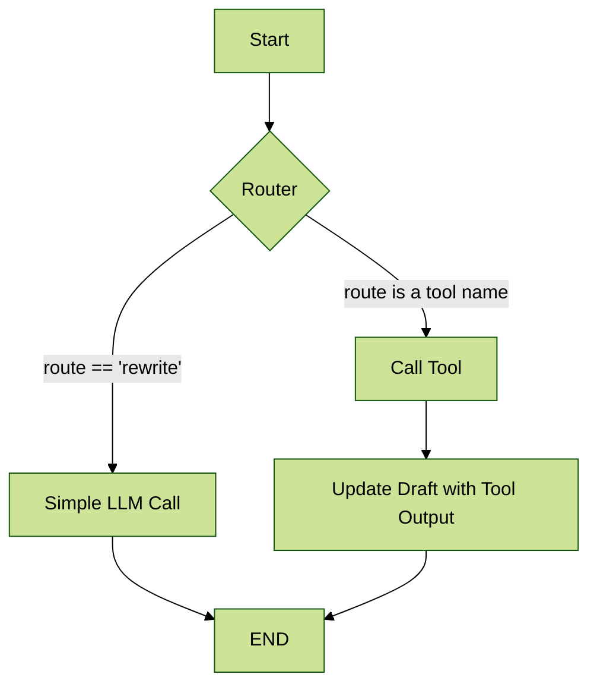

```mermaid
---
config:
  theme: 'forest'
---
graph TD
    A[Start] --> B{Router};
    B -- "route == 'rewrite'" --> C[Simple LLM Call];
    B -- "route is a tool name" --> D[Call Tool];
    C --> F[END];
    D --> E[Update Draft with Tool Output];
    E --> F;
```