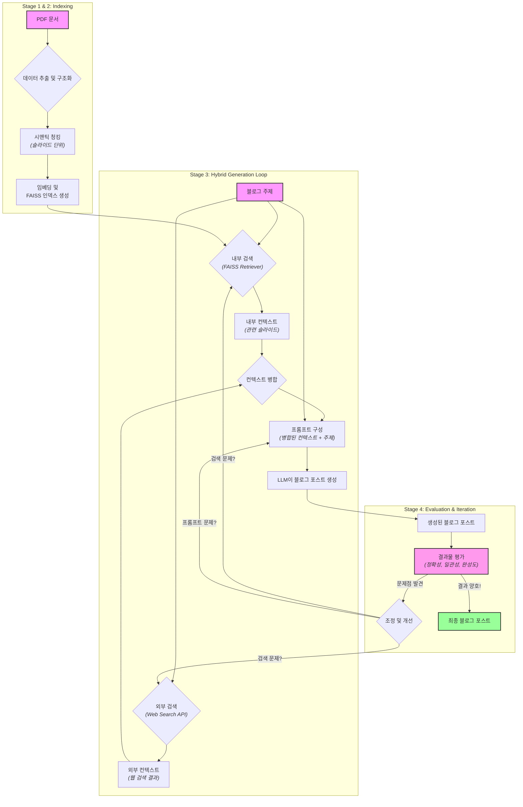

```mermaid
graph TD
    subgraph "Stage 1 & 2: Indexing"
        A["PDF 문서"] --> B{"데이터 추출 및 구조화"};
        B --> C["시맨틱 청킹<br><i>(슬라이드 단위)</i>"];
        C --> D["임베딩 및<br>FAISS 인덱스 생성"];
    end

    subgraph "Stage 3: Hybrid Generation Loop"
        E["블로그 주제"] --> F{"내부 검색<br><i>(FAISS Retriever)</i>"};
        D --> F;

        E --> G{"외부 검색<br><i>(Web Search API)</i>"};

        F --> H["내부 컨텍스트<br><i>(관련 슬라이드)</i>"];
        G --> I["외부 컨텍스트<br><i>(웹 검색 결과)</i>"];

        H --> J{"컨텍스트 병합"};
        I --> J;

        J --> K["프롬프트 구성<br><i>(병합된 컨텍스트 + 주제)</i>"];
        E --> K;

        K --> L["LLM이 블로그 포스트 생성"];
    end

    subgraph "Stage 4: Evaluation & Iteration"
        L --> M["생성된 블로그 포스트"];
        M --> N["결과물 평가<br><i>(정확성, 일관성, 완성도)</i>"];
        N -- "문제점 발견" --> O{조정 및 개선};
        O -- "검색 문제?" --> F & G;
        O -- "프롬프트 문제?" --> K;
        N -- "결과 양호!" --> P["최종 블로그 포스트"];
    end

    %% Styling
    style A fill:#f9f,stroke:#333,stroke-width:2px
    style E fill:#f9f,stroke:#333,stroke-width:2px
    style P fill:#9f9,stroke:#333,stroke-width:2px
    style N fill:#f9e,stroke:#333,stroke-width:2px
```
