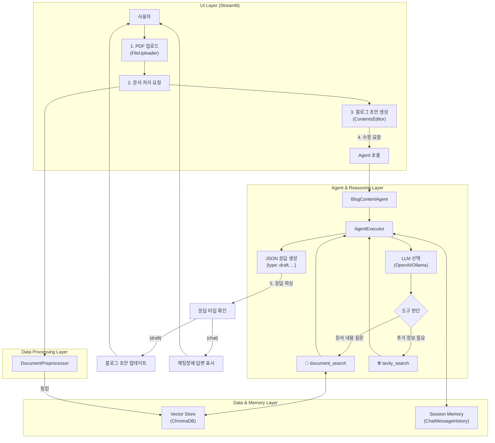

# 🏗️ 시스템 아키텍처

이 문서는 Blog Content Creator Agent 프로젝트의 아키텍처, 데이터 흐름, 그리고 주요 컴포넌트 간의 상호작용을 상세히 설명합니다.

## 1. 전체 아키텍처 다이어그램

아래 다이어그램은 사용자의 요청이 처리되는 전체 과정을 시각적으로 보여줍니다.

## **2. 컴포넌트별 상세 설명**

### **2.1 UI Layer (Streamlit)**

사용자 인터페이스는 **Streamlit**으로 구축되었으며, 단계별 워크플로우를 관리합니다.

* **src/app.py**:  
  * AppStage (AUTH, UPLOAD, EDIT, PUBLISH)를 통해 전체 애플리케이션의 상태를 관리합니다.  
  * 각 단계에 맞는 UI 컴포넌트를 렌더링하는 진입점 역할을 합니다.  
* **UI Components (src/ui/components/)**:  
  * **file_uploader.py**: PDF 파일 업로드를 처리하고, 백엔드의 DocumentPreprocessor와 VectorStore를 호출하여 문서 처리 및 저장을 실행합니다.  
  * **contents_editor.py**: 에이전트와 상호작용하는 핵심 UI입니다. 블로그 초안을 표시하고, 사용자의 수정 요청을 받아 BlogContentAgent에 전달하며, 반환된 JSON 응답을 파싱하여 UI를 동적으로 업데이트합니다.  
  * **github_auth.py** / **publisher.py**: GitHub 인증 및 최종 콘텐츠 게시를 담당합니다.

### **2.2 Data Processing & Storage Layer**

업로드된 PDF를 처리하고 검색 가능한 형태로 저장하는 역할을 합니다.

* **src/document_preprocessor.py**:  
  * configs/config.yaml의 parser 설정("local", "api", "unstructured")에 따라 적절한 문서 로더(예: PyMuPDFLoader)를 동적으로 선택합니다.  
  * RecursiveCharacterTextSplitter를 사용해 문서를 설정된 chunk_size와 chunk_overlap에 맞춰 분할합니다.  
* **src/vector_store.py**:  
  * configs/config.yaml의 embedding_provider 설정("openai", "huggingface")에 따라 임베딩 모델을 초기화합니다.  
  * 분할된 문서 청크를 벡터로 변환하여 **ChromaDB**에 저장합니다.  
* **src/retriever.py**:  
  * RetrieverFactory는 VectorStore를 기반으로 LangChain Retriever 객체를 생성합니다.  
  * config.yaml에 정의된 검색 유형(search_type: "mmr" 또는 "similarity")과 검색 인자(search_kwargs)가 이 단계에서 적용됩니다.

### **2.3 Agent & Reasoning Layer**

사용자의 요청을 이해하고, 도구를 사용하여 정보를 찾고, 최종 응답을 생성하는 프로젝트의 두뇌입니다.

* **src/agent.py - BlogContentAgent**:  
  * **초기화**: config.yaml 설정에 따라 LLM(예: ChatOpenAI, ChatOllama)을 초기화합니다.  
  * **도구 (Tools)**: 두 가지 핵심 도구를 사용합니다.  
    1. **document_search**: VectorStore에 저장된 문서 내용을 검색하는 Retriever 기반 도구입니다.  
    2. **tavily_search**: 외부 최신 정보나 문서에 없는 내용을 보강하기 위한 웹 검색 도구입니다.  
  * **메모리 (Memory)**: 세션 ID 기반의 ChatMessageHistory를 사용하여 대화의 맥락을 유지합니다. 이를 통해 사용자와의 연속적인 상호작용이 가능해집니다.  
  * **에이전트 실행**: LangChain의 create_tool_calling_agent와 AgentExecutor를 사용하여 구성됩니다. 이 구조는 LLM이 사용자의 질문 의도를 파악하고, 가장 적절한 도구를 스스로 선택하여 실행하도록 만듭니다.  
  * **응답 형식**: 에이전트는 항상 **JSON 형식**으로 응답하도록 프롬프트되어 있습니다. 응답은 type("chat" 또는 "draft")과 content(실제 내용) 필드를 포함하며, UI는 이 type에 따라 다른 동작을 수행합니다.

## **3. 데이터 흐름 (Workflow)**

1. **인증 및 업로드**: 사용자가 GitHub 인증 후 PDF 파일을 업로드합니다.  
2. **문서 처리**: FileUploader는 DocumentPreprocessor를 호출하여 문서를 텍스트 청크로 분할하고, VectorStore는 이 청크들을 임베딩하여 ChromaDB에 저장합니다. Retriever가 생성됩니다.  
3. **초안 생성**: ContentsEditor는 BlogContentAgent의 generate_draft 메서드를 호출합니다. 에이전트는 처리된 문서 전체 내용을 바탕으로 초기 블로그 초안을 생성하여 UI에 표시합니다.  
4. 대화형 수정:  
   a. 사용자가 채팅창에 "이 부분에 대해 웹에서 최신 정보를 찾아 추가해줘"라고 입력합니다.  
   b. ContentsEditor는 이 요청을 BlogContentAgent의 update_blog_post 메서드로 전달합니다.  
   c. AgentExecutor가 실행되고, LLM은 tavily_search 도구를 사용해야 한다고 판단합니다.  
   d. 웹 검색 결과와 대화 기록을 바탕으로 LLM은 수정된 블로그 초안을 생성합니다.  
   e. 에이전트는 {"type": "draft", "content": "<수정된 마크다운 내용>"} 형식의 JSON을 반환합니다.  
5. **UI 업데이트**: ContentsEditor는 응답의 type이 "draft"인 것을 확인하고, 왼쪽의 블로그 초안 패널 내용을 새 콘텐츠로 교체합니다. 만약 type이 "chat"이었다면, 채팅창에 AI의 답변을 표시했을 것입니다.  
6. **발행**: 사용자가 "발행" 버튼을 누르면, Publisher가 최종 초안을 Jekyll 형식에 맞게 가공하여 GitHub Repository에 푸시합니다.
