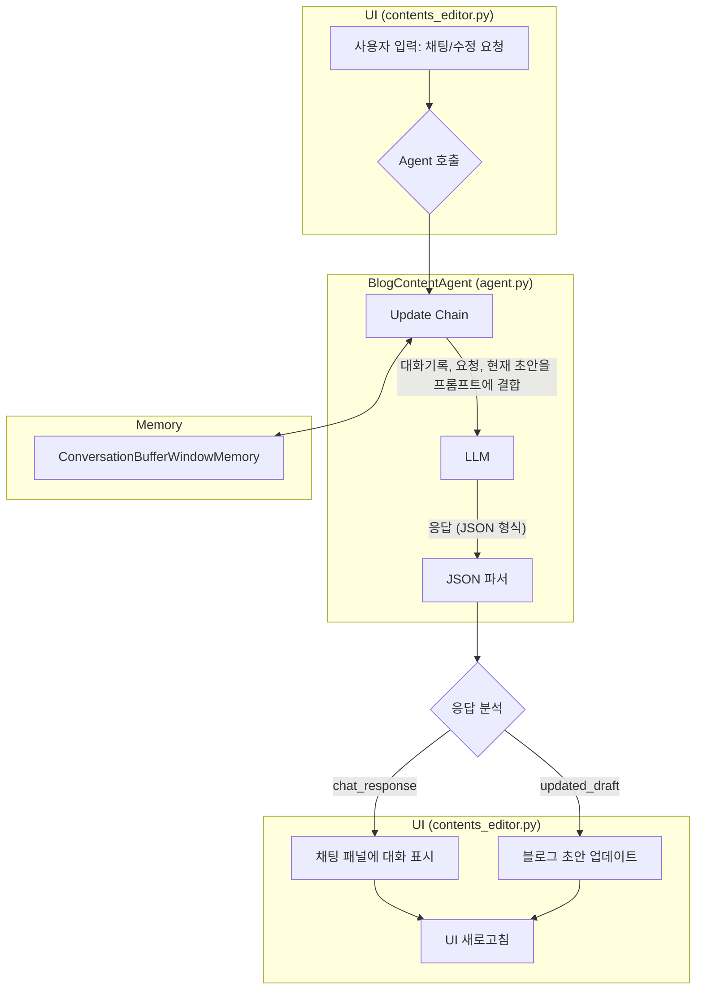

```mermaid
graph TD
    subgraph "UI (contents_editor.py)"
        A[사용자 입력: 채팅/수정 요청] --> B{Agent 호출};
    end

    subgraph "BlogContentAgent (agent.py)"
        B --> C[Update Chain];
        C -- 대화기록, 요청, 현재 초안을 프롬프트에 결합 --> D[LLM];
        D -- 응답 (JSON 형식) --> E[JSON 파서];
    end

    subgraph "Memory"
        F[ConversationBufferWindowMemory];
        C <--> F;
    end

    E --> G{응답 분석};
    G -- chat_response --> H[채팅 패널에 대화 표시];
    G -- updated_draft --> I[블로그 초안 업데이트];

    subgraph "UI (contents_editor.py)"
        H & I --> J[UI 새로고침];
    end

```