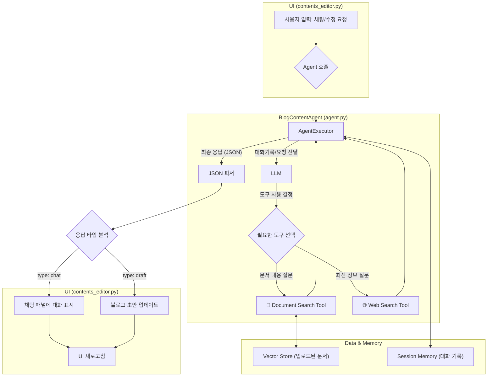

## **아키텍처 다이어그램 (Mermaid)**

새로운 Tool-Calling 에이전트의 작동 방식을 시각적으로 표현한 다이어그램입니다.

```mermaid
graph TD  
    subgraph "UI (contents_editor.py)"  
        A["사용자 입력: 채팅/수정 요청"] --> B{"Agent 호출"};  
    end

    subgraph "BlogContentAgent (agent.py)"  
        B --> C["AgentExecutor"];  
        C -- "대화기록/요청 전달" --> D["LLM"];  
        D -- "도구 사용 결정" --> E{"필요한 도구 선택"};  
        E -- "문서 내용 질문" --> F["📄 Document Search Tool"];  
        E -- "최신 정보 질문" --> G["🌐 Web Search Tool"];  
        F --> C;  
        G --> C;  
        C -- "최종 응답 (JSON)" --> H["JSON 파서"];  
    end

    subgraph "Data & Memory"  
        I["Vector Store (업로드된 문서)"];  
        J["Session Memory (대화 기록)"];  
        F <--> I;  
        C <--> J;  
    end

    H --> K{"응답 타입 분석"};  
    K -- "type: chat" --> L["채팅 패널에 대화 표시"];  
    K -- "type: draft" --> M["블로그 초안 업데이트"];

    subgraph "UI (contents_editor.py)"  
        L & M --> N["UI 새로고침"];  
    end 
``` 
