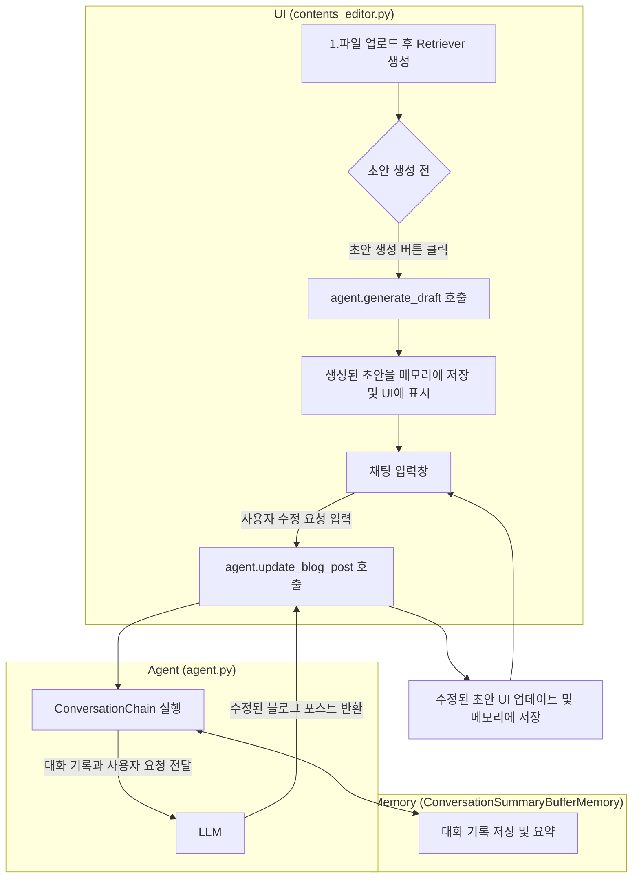

```mermaid
graph TD
    subgraph "UI (contents_editor.py)"
        A[1.파일 업로드 후 Retriever 생성] --> B{초안 생성 전};
        B -- "초안 생성" 버튼 클릭 --> C[agent.generate_draft 호출];
        C --> D[생성된 초안을 메모리에 저장 및 UI에 표시];
        D --> E[채팅 입력창];
        E -- 사용자 수정 요청 입력 --> F[agent.update_blog_post 호출];
    end

    subgraph "Agent (agent.py)"
        F --> G[ConversationChain 실행];
        G -- 대화 기록과 사용자 요청 전달 --> H[LLM];
    end
    
    subgraph "Memory (ConversationSummaryBufferMemory)"
        I[대화 기록 저장 및 요약]
    end

    H -- 수정된 블로그 포스트 반환 --> F;
    F --> J[수정된 초안 UI 업데이트 및 메모리에 저장];
    J --> E;

    G <--> I;
```