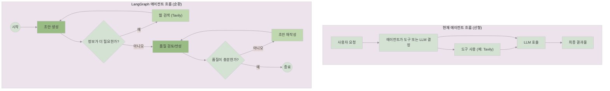

```mermaid
%%{ init: { 'theme': 'base', 'themeVariables': { 'primaryColor': '#D4E2D4', 'primaryTextColor': '#3A3A3A', 'lineColor': '#8E8E8E', 'textColor': '#3A3A3A'}}}%%
graph TD
    subgraph "현재 에이전트 흐름 (선형)"
        A["사용자 요청"] --> B["에이전트가 도구 또는 LLM 결정"];
        B --> C["도구 사용 (예: Tavily)"];
        B --> D["LLM 호출"];
        C --> D;
        D --> E["최종 결과물"];
    end

    subgraph "LangGraph 에이전트 흐름 (순환)"
        Start((시작)) --> N1["초안 생성"];
        N1 --> C1{"정보가 더 필요한가?"};
        C1 -- 예 --> N2["웹 검색 (Tavily)"];
        N2 --> N1;
        C1 -- 아니오 --> N3["품질 검토/반성"];
        N3 --> C2{"품질이 충분한가?"};
        C2 -- 아니오 --> N4["초안 재작성"];
        N4 --> N3;
        C2 -- 예 --> Finish((종료));
    end

    %% Styling
    style N1 fill:#99BC85
    style N2 fill:#BFD8AF
    style N3 fill:#99BC85
    style N4 fill:#BFD8AF
```