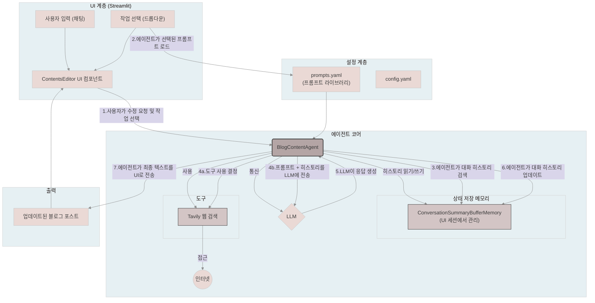

```mermaid
%%{ init: { 'theme': 'base', 'themeVariables': { 'primaryColor': '#EAD9D5', 'primaryTextColor': '#3A3A3A', 'lineColor': '#8E8E8E', 'textColor': '#3A3A3A'}}}%%
graph TD
    subgraph "UI 계층 (Streamlit)"
        A["사용자 입력 (채팅)"]
        B["작업 선택 (드롭다운)"]
        C["ContentsEditor UI 컴포넌트"]
        
        A --> C
        B --> C
    end

    subgraph "설정 계층"
        D["prompts.yaml<br>(프롬프트 라이브러리)"]
        E["config.yaml"]
    end

    subgraph "에이전트 코어"
        F(BlogContentAgent)
        subgraph "상태 저장 메모리"
            G["ConversationSummaryBufferMemory<br>(UI 세션에서 관리)"]
        end
        subgraph "도구"
            H["Tavily 웹 검색"]
        end
        I{LLM}

        F -- "히스토리 읽기/쓰기" --> G
        F -- "사용" --> H
        F -- "통신" --> I
        H -- "접근" --> J((인터넷))
    end

    subgraph "출력"
        K["업데이트된 블로그 포스트"]
    end

    C -- "1.사용자가 수정 요청 및 작업 선택" --> F
    B -- "2.에이전트가 선택된 프롬프트 로드" --> D
    D --> F
    F -- "3.에이전트가 대화 히스토리 검색" --> G
    F -- "4a.도구 사용 결정" --> H
    F -- "4b.프롬프트 + 히스토리를 LLM에 전송" --> I
    I -- "5.LLM이 응답 생성" --> F
    F -- "6.에이전트가 대화 히스토리 업데이트" --> G
    F -- "7.에이전트가 최종 텍스트를 UI로 전송" --> K
    K --> C

    %% Styling
    style F fill:#B4A5A5,stroke:#333,stroke-width:2px
    style G fill:#D3C5C5,stroke:#333,stroke-width:1px
    style H fill:#D3C5C5,stroke:#333,stroke-width:1px
```