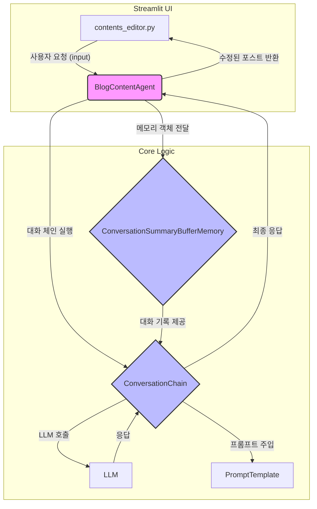

```mermaid
graph TD
    subgraph Streamlit UI
        A[contents_editor.py] -- "사용자 요청 (input)" --> B
    end

    subgraph Core Logic
        B(BlogContentAgent) -- "메모리 객체 전달" --> C{ConversationSummaryBufferMemory}
        B -- "대화 체인 실행" --> D{ConversationChain}
        D -- "LLM 호출" --> E[LLM]
        D -- "프롬프트 주입" --> F[PromptTemplate]
        C -- "대화 기록 제공" --> D
        E -- "응답" --> D
        D -- "최종 응답" --> B
    end

    B -- "수정된 포스트 반환" --> A

    style B fill:#f9f,stroke:#333,stroke-width:2px
    style C fill:#bbf,stroke:#333,stroke-width:2px
    style D fill:#bbf,stroke:#333,stroke-width:2px

```