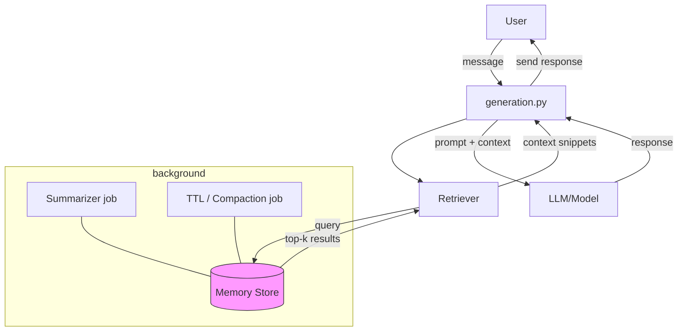

제목: 챗 컨텍스트 유지를 위한 Memory 기능 설계 및 구현

요약
사용자와 연속 대화를 할 때 앞선 내용이 유실되지 않도록 'memory' 기능을 설계하고 구현해 주세요. 현재 프로젝트에는 해당 기능이 비어 있습니다. 멘토 지시에 따라 우선 조사 및 POC를 진행하고, 이후 본 구현과 문서화를 목표로 합니다.

배경/문제
- 현재 채팅 세션에서 사용자가 여러 번 질문하면 이전 문맥(이전 사용자 발화, 챗봇 응답 등)을 충분히 반영하지 못해 대화 흐름이 끊길 수 있음.
- 장기 세션 또는 여러 세션에 걸쳐 문맥을 유지하는 메커니즘이 필요함.

목표
- 사용자의 이전 대화 일부를 저장하고, 새로운 질의에 적절히 참조할 수 있도록 함.
- 메모리 저장 전략(예: 최근 N 발화, 요약 저장, 벡터 임베딩+유사도 검색) 중 적절한 방식을 선정하고 POC 구현.
- 사용성(프라이버시, 용량 제한), 성능(응답 지연) 고려.

설계 옵션(예시)
1. 단순 윈도우: 최근 N개의 메시지 보존
2. 요약 기반: 일정 간격으로 대화 요약을 만들어 오래된 컨텍스트는 요약으로 대체
3. 벡터 임베딩 + 검색: 메시지들을 임베딩해 벡터 DB(chroma/faiss 등)에 저장하고 유사도 기반 검색으로 관련 문맥을 불러옴
4. 하이브리드: 요약 + 임베딩

Acceptance criteria
- 메모리 기능을 통해 이전 대화에서 관련 컨텍스트를 불러와 답변 품질이 향상됨(POC 데모).
- 간단한 설정(윈도우 크기, 요약 빈도, 벡터 DB 사용 여부)을 README에 문서화.
- 기본 단위 테스트/통합 테스트 포함.

작업 항목 (예상)
- [ ] 기술 조사 및 권장안 선택 (doc)
- [ ] 디자인 문서/설계 제안 (short.md)
- [ ] POC 구현 (예: `src/memory.py` + 간단한 integration)
- [ ] 자동화 테스트 추가
- [ ] README/사용법 문서화
- [ ] 코드 리뷰 & 병합

참조
- 현재 관련 코드/디렉토리: (indexing, ingestion, generation 등) — 필요 시 링크 추가

담당자: @최웅비 (할당 원치 않으면 비워두세요)
레이블 제안: enhancement, feature, discussion
우선순위: discuss

추가 코멘트
- 민감정보/개인정보 저장 여부는 정책 검토 필요.

## Research checklist — how to investigate and validate implementations

Use this checklist to guide a focused research & proof-of-concept phase. Mark items as you complete them.

- [ ] Survey common memory patterns and trade-offs
	- Read short references/articles on: windowed context, summarization-based memory, vector-based memory (embeddings + retrieval), and hybrid approaches.
- [ ] Identify candidate libraries and infra
	- Vector DBs: Chroma, FAISS, Milvus, Weaviate, Pinecone (managed)
	- Embedding models supported in our environment (OpenAI, HuggingFace, sentence-transformers, etc.)
	- Summarization and compression models (for long-term retention)
- [ ] Map project touchpoints
	- Where memory will integrate: `ingestion.py`, `indexing.py`, `generation.py`, and any agent/agent loop code.
- [ ] Define privacy & retention policy requirements
	- Which fields are allowed/forbidden to store (PII), retention period, opt-out, and GDPR-like considerations.
- [ ] Define simple evaluation metrics and tests
	- Relevance of retrieved memory (precision@k), context-coverage, conversation coherence A/B tests, latency budget.
- [ ] Cost and performance estimation
	- Estimate storage size per user/day, embedding compute cost per message, retrieval latency targets.
- [ ] Implement small POC variants (each on its own branch)
	- Windowed POC: store last N messages in memory and inject them into prompt.
	- Summarization POC: periodically summarize and keep summaries instead of raw messages.
	- Vector POC: embed messages, store in a local FAISS/Chroma index, retrieve top-k by similarity.
- [ ] Run micro-benchmarks
	- Measure round-trip latency for retrieval+generation for each POC and the memory hit rate.
- [ ] Safety, security & backup strategy
	- Check encryption at rest, secrets handling, and backup/restore for indexes.
- [ ] Decide on default strategy and config knobs
	- Example knobs: strategy = [window|summary|vector|hybrid], window_size, summary_interval, embedding_model, top_k.

## Key considerations (short guide)

- UX: how much context to include in prompts without breaking token limits. Prefer short relevant snippets or summaries.
- Freshness vs. compression: raw messages are freshest but expensive; summaries are compact but lossy.
- Retrieval quality: embeddings quality, choice of embedding model, and text pre-processing (chunking, metadata) strongly affect retrieval.
- Cost: embeddings and storage growth over time; consider downsampling or TTL policies per conversation.
- Privacy & compliance: never store secrets/PINs automatically; provide redaction / opt-out and explicit owner consent if needed.
- Scaling: vector stores may need sharding/replication as user count grows; keep local dev POCs lightweight.
- Observability: track memory hits/misses, retrieval latencies, and degradation over time.

## Recommended experiments (minimal):

1. Windowed baseline
	 - Implementation: store last N messages (e.g., N=6) in memory and prepend to prompt.
	 - Goal: easy implementation to measure immediate UX improvement.

2. Summarization strategy
	 - Implementation: after conversation length L or every T messages, run a summarizer to compress older messages into a single summary token and drop raw messages.
	 - Goal: measure memory retention quality vs prompt-token savings.

3. Vector retrieval
	 - Implementation: embed each message, store in Chroma (or FAISS) locally, retrieve top-k by similarity to current user query and inject into prompt.
	 - Goal: measure relevance and latency, and assess embedding cost.

4. Hybrid (summary + vector)
	 - Implementation: keep recent raw messages (window) + embeddings for summaries/important events; combine both in retrieval.
	 - Goal: best-effort for long conversations while controlling cost.

## Acceptance criteria (proposal)

- A POC that demonstrates improved response coherence on a set of 10 multi-turn scenarios (compare no-memory vs chosen strategy).
- End-to-end latency for retrieval + generation < configured budget (e.g., 2s for dev, 500ms target in prod depending on model).
- Tests: at least one unit test for memory insertion/retrieval and one integration test that exercises generation with memory.
- Documentation: `README` section with configuration options and operational notes (retention, privacy).

## Minimal API / design contract (suggested)

- Inputs: user_message (text), session_id (or user_id), optional metadata
- Outputs: list of context snippets (text + metadata) to include in prompt
- Error modes: index unavailable (graceful fallback to windowed context), embedding failure (retry or skip)

## Mermaid diagram — proposed high-level flow

## Next steps (operational)

1. Pick 1–2 POC strategies from above and create branches `feature/memory-window`, `feature/memory-vector`.
2. Implement the windowed POC first (fastest) and add basic integration tests.
3. Run user-simulation tests and collect metrics (latency, coherence improvements).
4. Iterate: if vector approach looks promising, build vector POC and compare.

---
Updated: add research checklist, experiments and a mermaid diagram to help planning and implementation.

-----

