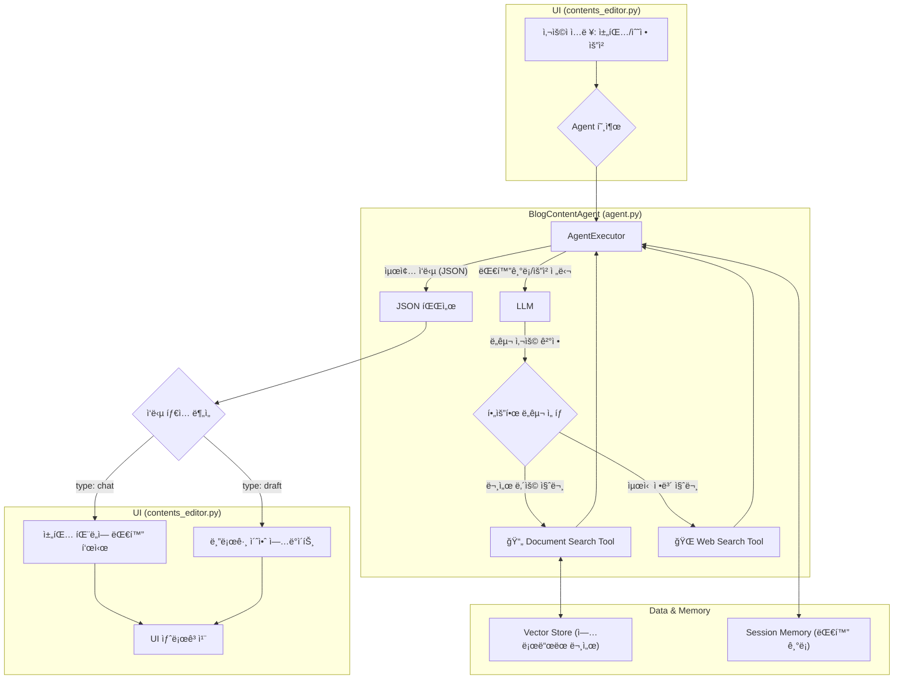

## **아키í…처 다ì´ì–´ê·¸ë¨ (Mermaid)**

새로운 Tool-Calling ì—ì´ì „íŠ¸ì˜ ì‘ë™ ë°©ì‹ì„ ì‹œê°ì ìœ¼ë¡œ 표현한 다ì´ì–´ê·¸ë¨ì…니다.

```mermaid
graph TD  
    subgraph "UI (contents_editor.py)"  
        A["사용ì ì…ë ¥: 채팅/수정 요청"] --> B{"Agent 호출"};  
    end

    subgraph "BlogContentAgent (agent.py)"  
        B --> C["AgentExecutor"];  
        C -- "대화기ë¡/요청 전달" --> D["LLM"];  
        D -- "ë„구 사용 ê²°ì •" --> E{"필요한 ë„구 ì„ íƒ"};  
        E -- "문서 내용 질문" --> F["📄 Document Search Tool"];  
        E -- "최신 정보 질문" --> G["🌠Web Search Tool"];  
        F --> C;  
        G --> C;  
        C -- "최종 ì‘답 (JSON)" --> H["JSON 파서"];  
    end

    subgraph "Data & Memory"  
        I["Vector Store (ì—…ë¡œë“œëœ ë¬¸ì„œ)"];  
        J["Session Memory (대화 기ë¡)"];  
        F <--> I;  
        C <--> J;  
    end

    H --> K{"ì‘답 íƒ€ì… ë¶„ì„"};  
    K -- "type: chat" --> L["채팅 패ë„ì— ëŒ€í™” 표시"];  
    K -- "type: draft" --> M["블로그 초안 ì—…ë°ì´íŠ¸"];

    subgraph "UI (contents_editor.py)"  
        L & M --> N["UI 새로고침"];  
    end 
``` 
