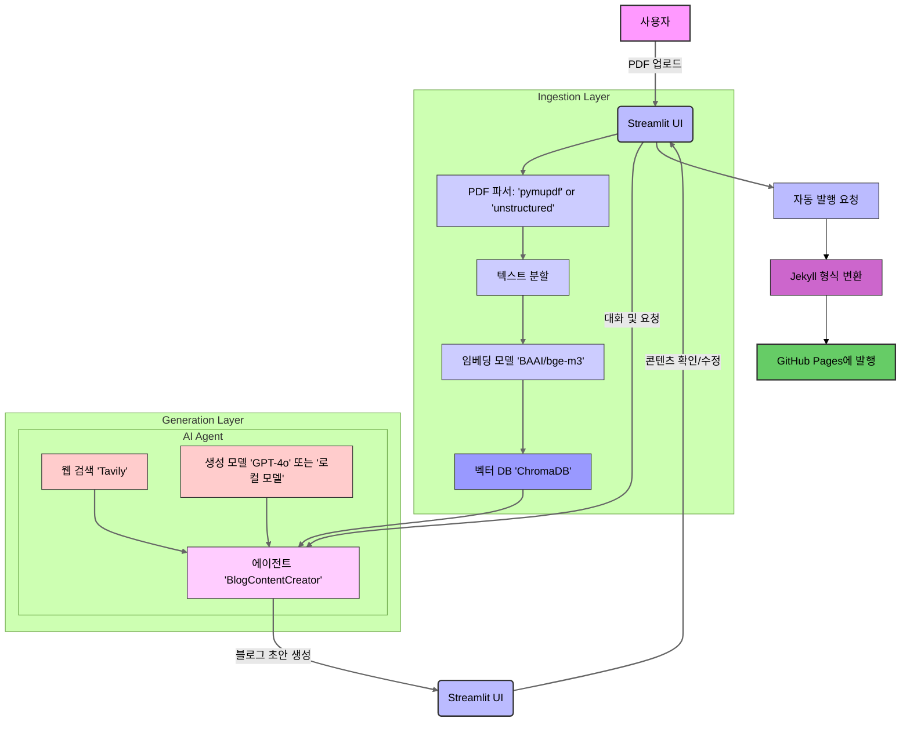

### GitHub Pages 사전 요구사항 추가

블로그 발행 기능을 사용하기 위해 GitHub Pages 설정이 필수적이라는 점을 `README.md`에 추가하는 것은 매우 중요합니다. 이 정보는 "빠른 시작" 또는 "주요 특징" 섹션에 통합하는 것이 가장 적절합니다.

**제안:** "주요 특징" 섹션에 "자동 발행"에 대한 설명을 보강하고, "빠른 시작" 섹션의 "사전 요구사항"에 GitHub Pages 설정을 추가합니다.

**수정된 "주요 특징" 섹션:**

## ✨ 주요 특징 (Key Features)

* **RAG 기반 콘텐츠 생성**: `PDF` 문서 내용을 기반으로 정확하고 일관성 있는 블로그 초안을 생성합니다.
* **동적 도구 사용**: `document_search`와 `tavily_search` 도구를 활용하여 문서 및 웹의 정보를 동적으로 결합합니다.
* **설정 가능한 아키텍처**: `config.yaml`을 통해 LLM, 임베딩 모델, 데이터 처리 방식을 유연하게 변경할 수 있습니다.
* **대화형 수정**: Streamlit 기반 UI에서 AI 에이전트와 대화하며 실시간으로 콘텐츠를 수정하고 개선할 수 있습니다.
* **자동 발행**: 완성된 콘텐츠를 Jekyll 형식에 맞게 변환하여 **사전에 설정된 GitHub Pages**에 자동으로 게시합니다.

**수정된 "빠른 시작" 섹션:**

## 🚀 빠른 시작 (Quick Start)

### **사전 요구사항**

* Python 3.11+
* Poetry
* **GitHub Pages 설정 완료**: 블로그 발행을 위해 GitHub Pages 리포지토리가 미리 설정되어 있어야 합니다.

-----

### 프로젝트 흐름을 나타내는 Mermaid 다이어그램 (한국어)

프로젝트의 전체 흐름을 시각적으로 보여주는 Mermaid 다이어그램은 `README.md`의 이해도를 크게 높여줍니다. "핵심 구성 요소" 섹션 바로 아래에 배치하는 것을 추천합니다.

다음은 Mermaid 표준 문법을 사용하여 작성된 다이어그램 코드입니다. 이 코드를 Markdown 파일에 그대로 붙여넣으면 GitHub에서 자동으로 렌더링됩니다.

**다이어그램 설명:**

  * **Ingestion Layer (수집 계층)**: 사용자가 업로드한 PDF 문서가 텍스트로 변환되고, 임베딩 모델을 통해 벡터로 만들어져 벡터 데이터베이스에 저장되는 과정을 보여줍니다.
  * **Generation Layer (생성 계층)**: AI 에이전트가 벡터 데이터베이스와 웹 검색 도구를 활용하여 블로그 초안을 생성하는 과정을 보여줍니다. 사용자와의 대화를 통해 수정 및 개선이 이루어집니다.
  * **전체 흐름**: 사용자 입력부터 시작하여 콘텐츠 생성, 수정, 그리고 최종적으로 GitHub Pages에 발행되는 전체 프로세스를 한눈에 파악할 수 있도록 구성되었습니다.